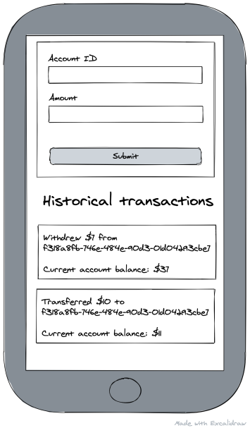

# Account Management Mobile - Level 3
**Before you get started, please read [this guide](https://www.notion.so/Get-started-with-your-assignment-dade100d93054a6db1036ce294bdaeb6)** that walks you through how to submit your solution and get help.

### Estimated time investment ⏳
Try not to spend more than **3 hours**.

### The challenge 🎯
Your task is to build a Mobile app that integrates with a predefined backend service. The backend service implements this [API specification](api-specification.yml) that defines a set of operations for creating and reading account transactions. You can use [editor.swagger.io](https://editor.swagger.io/) to visualize the spec.

#### App mockup 🧱

#### App specification 📘
* There's a form with two input fields: Account ID and Amount. Whenever the form is submitted, a new transaction with the collected data should be created on the backend, and the corresponding input fields are cleared.
* There's a list of the previously submitted transactions. Every newly submitted transaction should appear at the top of the list.

### Our expectations 🔍
- **Integrate with the provided REST API**. Using the API spec, integrate with the provided backend service to fulfill the app specification.
- **Implement robust user input validation**. The API has restrictions on the incoming data format (watch out for both the headers and the body). Make sure to perform the required checks before calling the backend.
- **Implement offline support**. Cover the case that a transaction might fail to send due to the device being offline.
- **Modularize your code**. Extract components that help you avoid duplication, but don't break things apart needlessly. We want to see that you can implement the UI with sound semantics.
- **Document your solution**. Include the following information:
  1. How to run your app.
  2. The motivation for the offline support approach you implemented.

### The provided boilerplate 🗂
* The [backend service specification](api-specification.yml) in the Open API format.
* The backend service itself. To run locally:
  * Install the required dependencies using `npm install` (this command will download the necessary dependencies. Please give it some time to finish). 
  * Spin up the service using `npm run start:backend`. It'll be available on `http://localhost:8080/`.
  
---

Made by [DevSkills](https://devskills.co). 

How was your experience? **Give us a shout on [Twitter](https://twitter.com/DevSkillsHQ) / [LinkedIn](https://www.linkedin.com/company/devskills)**.
